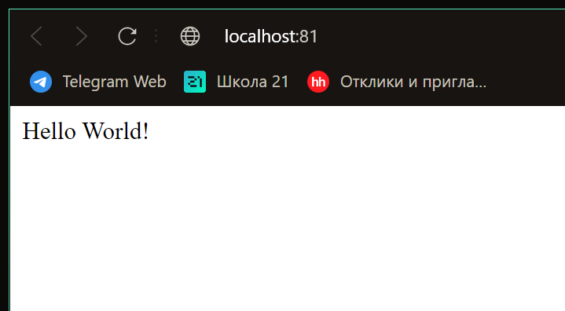

# Simple Docker

Введение в докер. Разработка простого докер образа для собственного сервера.

## Contents
1. [Готовый докер](#задание-1)
2. [Операции с контейнером](#задание-2)
3. [Мини веб-сервер](#задание-3)
4. [Свой докер](#задание-4)
5. [Dockle](#задание-5)
6. [Базовый Docker Compose](#задание-6)

## Задание 1
- **1.1 Тестовый запуск**

    Скачиваем докер образ с **nginx** с помощью команды `docker pull nginx`, и проверяем его наличие командой `docker images` которая выводит список всех образов верхнего уровня

    |  |
    |:--:|
    | *Вывод списка образов* |

    Запустим докер образ `docker run -d [repository]` и проверим запустился ли он командой `docker ps`

    |  |
    |:--:|
    | *Вывод списка запущенных образов* |

    Так как команда `docker inspect [container_name]` выводит слишком много ненужной нам информации, будеим использовать форматирование:

        - {{.SizeRootFs}} - Для вывода размера контейнера
        - {{.NetworkSettings.IPAddress}} - Для вывода ip контейнера
        - {{.Config.ExposedPorts}} - Для вывода списка замапленных портов

    Нужная информация получена, можно остановить образ командой `docker stop [container_name]` и проверить его отсутствие в списке запущенных образов

    |  |
    |:--:|
    | *Вывод информации о контейнере и его остановка* |

- **1.2 Запуск на портах 80 и 443**

    Запустим докер с портами 80 и 443 командой `docker run -p 80:80 -p 443:443 -d [repository]` и перейдем на *localhost* в браузере

    |  |
    |:--:|
    | *nginx localhost* |

    Перезапустим контейнер командой `docker restart [container_name]` и посмотрим запустился ли он

    |  |
    |:--:|
    | *перезапуск контейнера* |

## Задание 2

- **2.1 Настройки конфигурации сервера**

    Посмотрим что находится в файле *nginx.conf* внутри контейнера:

    |  |
    |:--:|
    | *Конфигурация nginx* |

    Создадим себе такой же файл конфигурации и добавим туда вывод страницы статуса по пути */status*, содержимое файла *nginx.conf*:

        user  nginx;
        worker_processes  auto;

        error_log  /var/log/nginx/error.log notice;
        pid        /var/run/nginx.pid;


        events {
            worker_connections  1024;
        }


        http {
            server {
            
                location /status/ {
                    stub_status;
                }
            }
        }

    Скопируем созданый файл конфигурации в докер контейнер и перезапустим nginx сервер:

    |  |
    |:--:|
    | *Перезапуск сервера* |

    Проверим работу сервера, для этого перейдем по адресу *http://localhost/status/*

    |  |
    |:--:|
    | *Страница статуса сервера* |

- **2.2 Экспорт и Импорт контейнера**

    Экспортируем контейнер и останавливаем его и проверяем остановился ли он

    |  |
    |:--:|
    | *Экспорт* |

    Теперь удаляем образ, нас предупреждают что у нас есть контейнер который использует этот образ, для того чтобы удалить образ не удаляя контейнер применим ключ `-f`, а затем удалим и сам контейнер

    |  |
    |:--:|
    | *Удаление образа и контейнера* |

    Мы удалили контейнер и образ, но у нас в архиве есть уже настроенный образ который мы импортируем и запустим:

    |  |
    |:--:|
    | *Импорт образа* |

    |  |
    |:--:|
    | *Запуск контейнера* |

    Осталось лишь проверить выведет ли нам статус сервера по адресу *http://localhost/status/* (спойлер да)

    |  |
    |:--:|
    | *Статус сервера* |

## Задание 3

- **3.1 Мини сервер на C и FastCgi**

    Напишем простой сервер на си который просто выводит *Hello World!*

    ```c
    #include <stdio.h>

    #include "fcgi_stdio.h"

    int main(void) {
        while (FCGI_Accept() >= 0) {
            printf("Content-type: text/html\r\nStatus: 200 OK\r\n\r\nHello World!");
        }
        return 0;
    }
    ```

    Пропишем для него nginx конфиг на 81 порт:

    ```json
    server {
        listen 81;

        location / {
            fastcgi_pass 127.0.0.1:8080;
        }

    }
    ```

    Теперь нужно запустить контейнер на 81 порту, установить на него все зависимости, перенести файлы конфига и сам файл сервера, скомпилировать программу и запустить nginx

    Для удобства был создан Makefile со всеми правилами, достаточно перейти в папку *server/* и запустить команду `make`

    Проверим что все работает, перейдем по адресу *http://localhost:81*

    |  |
    |:--:|
    | *Сервер на Си* |

    Отлично все работает!

## Задание 4

- **4.1 Cвой докер образ**

    Для создания своего докер образа нам понадобится написать *Dockerfile* где будут прописаны все инструкции по его созданию:

    ```Dockerfile
    FROM nginx:latest

    USER root

    WORKDIR /home/

    COPY run.sh .
    COPY server/server.c .
    COPY server/nginx/nginx.conf /etc/nginx/

    RUN apt-get update && apt-get install -y gcc spawn-fcgi libfcgi-dev

    ENTRYPOINT bash run.sh
    ```

    Тут мы выбираем базовый слой *nginx* на основе которого строиться образ, переносим все необходимые файлы, скачиваем зависимости и запускаем скрипт, который собирает исходники и запусккает сервер:

    ```bash
    #!/bin/bash

    gcc server.c -lfcgi -o server
    service nginx start
    nginx -s reload
    spawn-fcgi -p 8080 -n server
    ```

    Теперь можем забилдить образ и запустить контейнер с маппингом nginx конфигураций из нашей локальной машины с помощью скрипта *build.sh*

    |  |
    |:--:|
    | *Сборка образа* |

    Перейдем на *http://localhost:80* и проверим что все работает

    |  |
    |:--:|
    | *Ответ сервера* |

    Теперь добавим на локальной машине проксирование странички /status и перезапустим nginx в контейнере, если все настроено правильно то мы увидим статус на страничке

    |  |
    |:--:|
    | *Ответ сервера* |

    УРА!!!

## Задание 5

- **5.1 Проверка безопасности образа**

    Скачаем **Dockle**, просканируем образ и посмотрим, что стоит исправить:

    |  |
    |:--:|
    | *Dockle проверка* |

    Исправим файлы *Dockerfile* и *build.sh* следующим образом:

    *build.sh*
     ```bash
    #!/bin/bash

    export DOCKER_CONTENT_TRUST=1
    sudo docker build -t hehe:1.0 .
    sudo docker run --name roi -p 80:81 -dit -v $(pwd)/server/nginx/nginx.conf:/etc/nginx/nginx.conf hehe:1.0
    ```

    *Dockerfile*
    ```Dockerfile
    FROM nginx:latest

    WORKDIR /home/

    COPY run.sh .
    COPY server/server.c .
    COPY server/nginx/nginx.conf /etc/nginx/

    RUN apt-get update && apt-get install -y gcc spawn-fcgi libfcgi-dev; \
        chown -R nginx:nginx /etc/nginx/nginx.conf; \
        chown -R nginx:nginx /home/; \
        chown -R nginx:nginx /var/run/nginx.pid; \
        rm -rf /var/lib/apt/lists

    USER nginx

    ENTRYPOINT bash run.sh
    HEALTHCHECK NONE
    ```

    Просканируем еще раз:

    |  |
    |:--:|
    | *Dockle проверка* |

    Теперь все отлично!

# Задание 6

- **6.1 docker-compose**

    Пропишем *docker-compose.yml*, который поднимает докер контейнер из прошлой части в локальной сети, а так же контейнер с nginx, который будет проксировать все запросы с 8080 порта на 81 порт первого контейнера:

    ```yml
    services:
        server:
            build: ../task4-5
        proxy:
            build: .
            volumes:
            - ./nginx.conf:/etc/nginx/nginx.conf
            ports:
            - 80:8080
    ```

    Теперь пропишем конфигурацию nginx для этого контейнера:

    ```json
    server {
        listen 8080;
        listen [::]:8080;

        location / {
            proxy_pass http://server:81;
        }
    }
    ```

    Наконец можем собрать проект командой `docker-compose build` и запустить его `docker compose up -d`

    Давайте насладимся последними скринами...

    |  ___ |
    |:--:|
    | *Ответ сервера* |